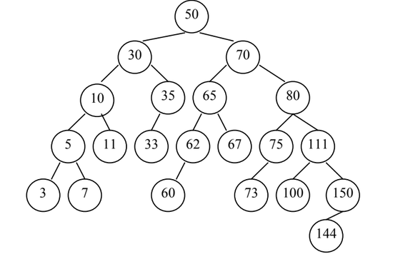

# LISTA ABP e AVL
**1. Quando dois elementos são removidos de uma árvore binária de pesquisa a árvore final depende da ordem em que eles são removidos? Justifique a sua resposta com exemplos.**

**Resposta:** Sim, uma vez que o elemento que está sendo removido exige que o menor sucessor maior que o número removido seja colocado em seu lugar (caso ele tenha dois filhos), sendo esse o pior caso, mas em todos os casos, a árvore muda sua estrutura conforme a ordem em que os elementos são removidos.

**2. Qual o efeito de se incluir os números de 1 a 10 em ordem crescente em uma árvore binária de pesquisa?**

**Resposta:** Ao incluir uma sequência de números ordenados de 1 a 10, a árvore ficará desbalanceada e degenerada, tornando todas as suas operações em O(n) no pior caso por se comportar como uma lista encadeada.

**3. Assuma que a árvore anterior é AVL. Como ficaria a evolução dessas inserções?**

**4. Mostre a evolução de uma árvore AVL, inicialmente vazia, com a inserção das seguintes chaves: 2, 1, 4, 5, 9, 3, 6 e 7. Havendo rotações, indique-as.**

**5 - Dada a árvore AVL, abaixo, mostre o efeito de se retirar os seguintes elementos: 7, 11, 73, 100 e 67.**

**6. Para uma árvore AVL inicialmente vazia, faça os seguintes procedimentos:
a) Insira os elementos 15, 8, 90, 44, 65, 22, 36, 78, 84, 11, 2, 19
b) Remova os elementos 8, 65, 44 e 15**

**7 - Data uma árvore binária de pesquisa T qualquer, crie em Java um método recursivo que indique se a árvore T é uma árvore com todos os seus nós balanceados segundo o critério de balanceamento AVL.**

**8 - Dados as chaves 1, 2, 3, 4, 5 e 6. Quais seqüências de inserção das chaves em uma árvore binária de pesquisa (sem balanceamento) promovem a construção de uma árvore AVL?**

**9 - Baixe da página da disciplina o arquivo arqs.zip e implemente Arvore Binaria de Pesquisa e AVL.**

**10 - Após implementar todos os métodos do exercício 9, utilize o arquivo TesteBSTAVL.java e os arquivos:arv1f.avl, arv2f.avl, ..., arv10f.avl (valores positivos serão incluídos, negativos removidos, e zero sair). Para cada arquivo efetue as operações em papel e compare com o resultado da implementação.**